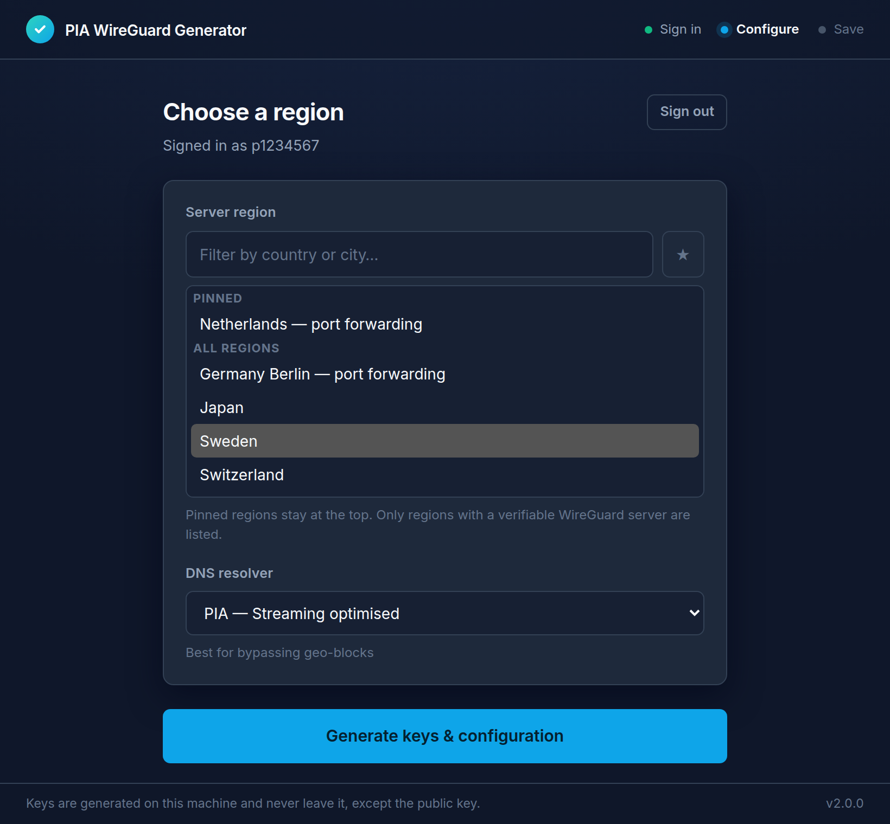
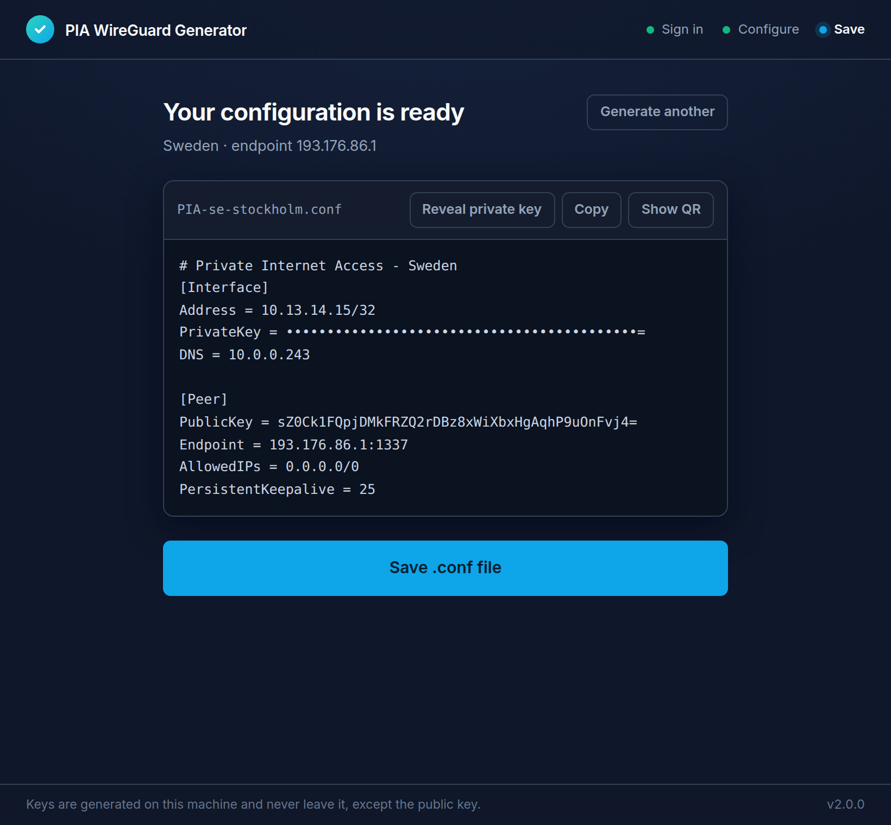

<div align="center">


# PIA WireGuard Generator

**Generate standalone WireGuard® configuration files for Private Internet Access — without installing their app.**

[](https://github.com/vonRoX/PIA-WireGuard-Generator/actions/workflows/ci.yml)
[](LICENSE)


</div>

---

PIA hands out OpenVPN profiles, but getting a **WireGuard** config out of them means running their
desktop app. That leaves out routers, a Raspberry Pi, pfSense, OPNsense, a NAS, or anything else that
speaks WireGuard and nothing else.

This tool does what their app does at the protocol level: generate a Curve25519 key pair on your
machine, register the public half with a PIA server, and write out a `.conf` you can import anywhere.
The private key never leaves the computer you ran it on.

<div align="center">



</div>

## What it does

- **Real WireGuard configs.** Plain `.conf` files that any WireGuard client will import — routers,
  phones, servers, containers.
- **Keys generated locally.** Curve25519 in the app itself. You do not need WireGuard, `wg`, or Go
  installed to produce a configuration.
- **Every PIA region, live.** Fetched from PIA's server list at launch, filtered to regions that
  actually offer WireGuard. Pin the ones you use.
- **DNS you choose.** PIA's in-tunnel resolvers — standard, streaming-optimised, or MACE ad-blocking
  — or any resolver of your own.
- **Import by QR.** Scan straight into the WireGuard app on a phone.
- **Nothing phones home.** No analytics, no update checks, no fonts from a CDN. The only hosts it
  ever contacts are Private Internet Access's own.

<div align="center">



</div>

## Using it

1. Download the build for your platform from [Releases](../../releases), or
   [build it yourself](#building-from-source).
2. Sign in with your PIA username (it starts with `p`) and password.
3. Pick a region and a DNS resolver.
4. **Generate**, then **Save .conf file** — or scan the QR code from your phone.
5. Import the file into your router or client.

> [!TIP]
> `PersistentKeepalive = 25` is already set, which is what you want behind NAT. If your client
> expects the interface address without a prefix, drop the `/32`.

> [!IMPORTANT]
> The app needs **curl**, which Windows 10+, macOS, and most Linux distributions already ship. If it
> is missing, the app says so on startup instead of failing later. On a minimal container you may
> need to install it.

## Security

This tool handles a VPN credential and writes a private key to disk, so it is worth being precise
about what it does.

**Your password never touches a command line.** Requests are made with curl, because the webview
cannot call PIA's API directly — their endpoints send no CORS headers. But the command executed is
always the fixed string `curl -q --config -`, and the entire request travels to it on standard
input as a curl configuration file. Nothing you type is ever parsed by a shell, so a password
containing `` ` ``, `$( )`, `&`, `%VAR%` or a quote is just a password. It is also never visible in
`ps` output, in shell history, or to process-monitoring software.

**Certificates are verified, including PIA's internal ones.** The key-registration endpoint runs on
PIA's own certificate authority rather than a public one. This app bundles that CA and pins to it,
completing the handshake against the server's certificate name — the same approach PIA's published
`manual-connections` scripts use. If verification fails, the request fails: no key is registered and
no configuration is written. Earlier versions of this tool passed `-k` here, which accepted any
certificate at all.

On Windows, where curl verifies through Schannel, pinned requests additionally pass
`--ssl-revoke-best-effort`, because PIA's authority publishes no revocation endpoint for Schannel to
consult. That tolerates revocation data being missing; it does not skip verification, and a revoked
certificate is still rejected.

**Your session token is not stored unless you ask.** "Stay signed in" is off by default. When it is
off the token lives in memory and is gone when you quit. When it is on, it is stored with a recorded
expiry and revalidated on the next launch. Signing out erases it.

**Saved configurations are owner-only.** The `.conf` contains your private key, so it is written with
`0600` permissions. If the platform refuses, the app tells you rather than assuming.

**Nothing is sent anywhere else.** A `Content-Security-Policy` of `default-src 'none'` means the app
window cannot load a remote script, style, font, or image even if one were added by mistake. A test
in the suite fails the build if any non-PIA URL appears in the source.

Found a problem? See [SECURITY.md](SECURITY.md). Please do not open a public issue for it.

## Building from source

```bash
git clone https://github.com/vonRoX/PIA-WireGuard-Generator.git
cd PIA-WireGuard-Generator

npm install
npm run build        # binaries for every platform, in dist/
```

`npm run build` runs `neu update` first — without it the Neutralino client library is missing and
`neu build` writes nothing while still reporting success. The build ends in
`scripts/verify-build.mjs`, which fails loudly if no real binary was produced.

To run it during development:

```bash
npm start            # launches the app
npm test             # unit and integration tests
npm run test:e2e     # browser tests (needs: npx playwright install chromium)
npm run lint
```

The test suite runs entirely offline. Command-injection payloads are pushed through a real shell and
a real curl; certificate pinning is checked against a local TLS server with a throwaway CA, including
that a certificate from the wrong authority is rejected.

## How it works

```
 you ──▶ sign in ──▶ POST /api/client/v2/token          ▶ session token
             │
             ├─▶ GET serverlist.piaservers.net/…/v6     ▶ regions with WireGuard
             │
             └─▶ generate X25519 keypair (locally)
                        │
                        └─▶ GET https://<cn>:1337/addKey   ▶ peer IP, server key, endpoint
                              --cacert <PIA CA>             │
                              --connect-to <cn>:1337:<ip>:1337
                                                            └─▶ .conf written to disk
```

The application is Neutralinojs, so a release binary is a few megabytes rather than a bundled
browser. More detail lives in [`docs/wiki/`](docs/wiki/), including the
[security model](docs/wiki/architecture/Security_Model.md).

## Disclaimers

- **Not affiliated with Private Internet Access.** This is a community tool. It is not endorsed by,
  associated with, or supported by PIA.
- **WireGuard** is a registered trademark of Jason A. Donenfeld.
- Your credentials go to `privateinternetaccess.com` and nowhere else. That is a design property with
  tests behind it, not just a promise — but you are welcome to read the source and check.

## Licence

[MIT](LICENSE). Bundled third-party components keep their own licences — see the end of that file.
